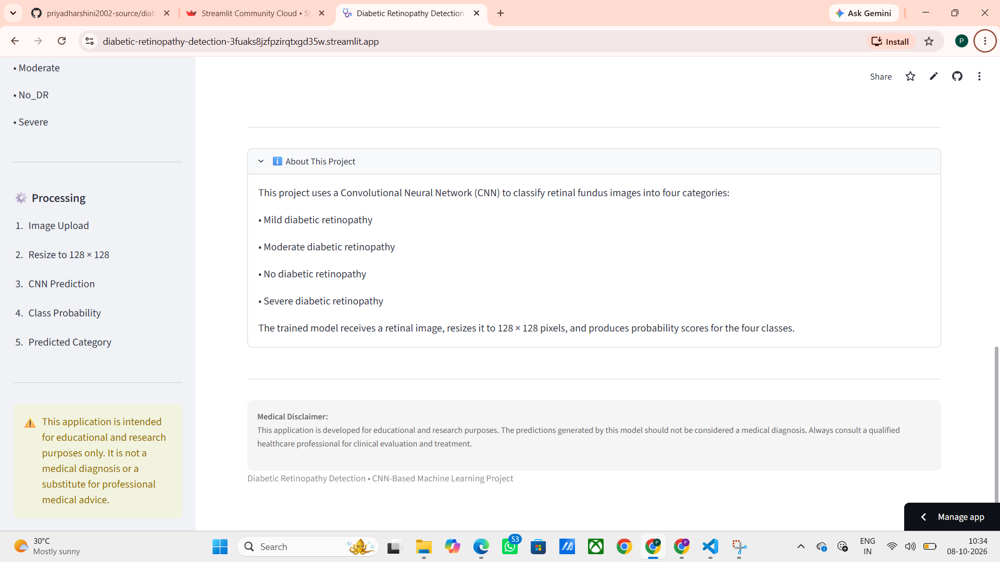
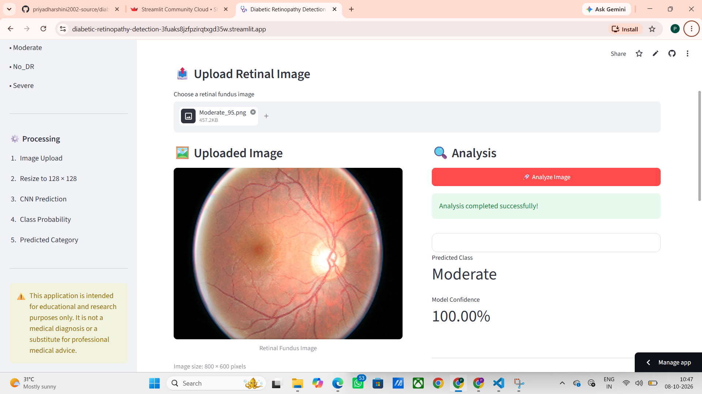
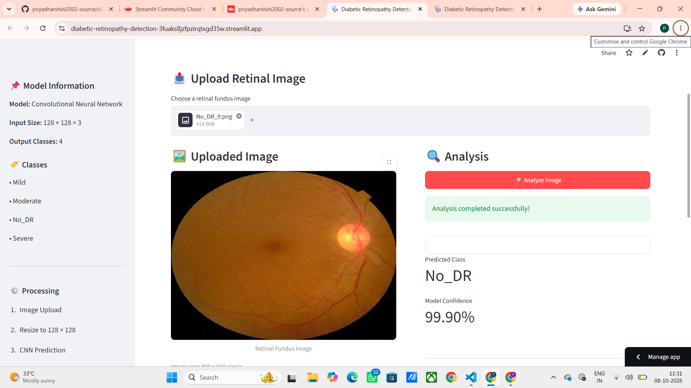
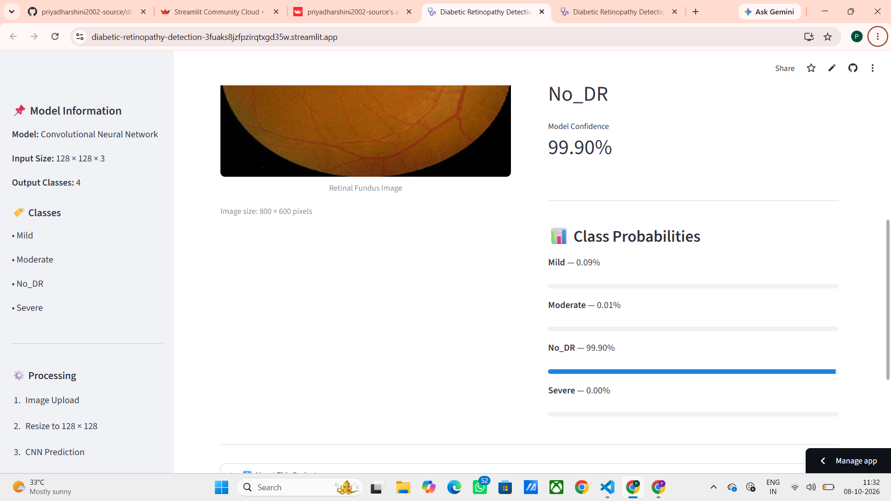
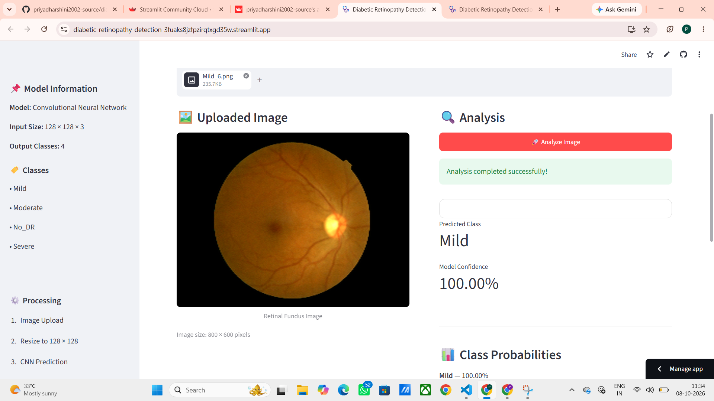
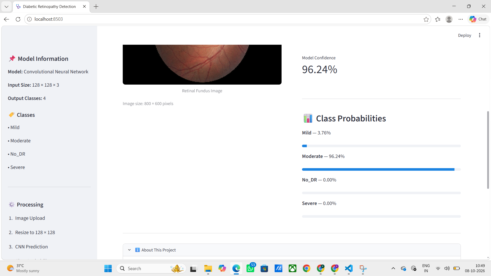
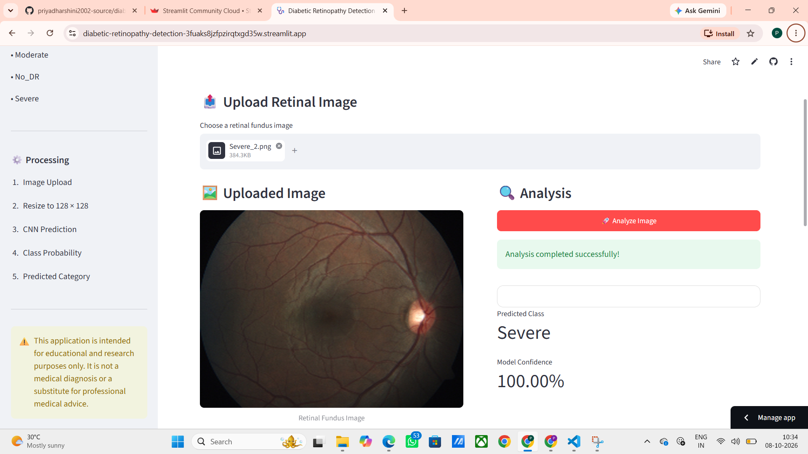

# 🩺 Diabetic Retinopathy Detection Using CNN

A deep learning-based web application for detecting and classifying **Diabetic Retinopathy (DR)** from retinal fundus images using a **Convolutional Neural Network (CNN)**.

The application classifies retinal images into four categories:

- **Mild**
- **Moderate**
- **No Diabetic Retinopathy (No_DR)**
- **Severe**

The trained CNN model is integrated with a **Streamlit web application**, allowing users to upload a retinal image and receive a predicted class along with its confidence and class probabilities.

---

## 🚀 Live Demo

The trained model is deployed as an interactive Streamlit application.

**Live Demo:**  
https://diabetic-retinopathy-detection-3fuaks8jzfpzirqtxgd35w.streamlit.app/

---

## 📌 Project Overview

Diabetic Retinopathy is an eye condition associated with diabetes that can damage the blood vessels of the retina and may lead to vision impairment.

This project demonstrates the application of **Deep Learning and Computer Vision** for retinal image classification.

A Convolutional Neural Network is trained to identify the severity category of diabetic retinopathy from retinal fundus images.

The trained model is then integrated into a Streamlit application to provide an interactive image-based prediction system.

---

## 🎯 Objectives

The main objectives of this project are:

- Develop a CNN-based image classification model.
- Classify retinal fundus images into four DR categories.
- Process retinal images using deep learning techniques.
- Generate prediction confidence and class probabilities.
- Build an interactive web application using Streamlit.
- Demonstrate the application of AI in healthcare image analysis.

---

## 🧠 Classification Classes

| Class | Description |
|---|---|
| **Mild** | Mild stage of diabetic retinopathy |
| **Moderate** | Moderate stage of diabetic retinopathy |
| **No_DR** | No diabetic retinopathy detected |
| **Severe** | Severe stage of diabetic retinopathy |

---

## 🏗️ CNN Model Architecture

The project uses a **Convolutional Neural Network (CNN)** for image classification.

### Architecture

```text
Input Retinal Image
        │
        ▼
   128 × 128 × 3
        │
        ▼
Conv2D – 32 Filters
        │
        ▼
 MaxPooling2D
        │
        ▼
Batch Normalization
        │
        ▼
Conv2D – 64 Filters
        │
        ▼
 MaxPooling2D
        │
        ▼
Batch Normalization
        │
        ▼
Conv2D – 64 Filters
        │
        ▼
 MaxPooling2D
        │
        ▼
Batch Normalization
        │
        ▼
Conv2D – 96 Filters
        │
        ▼
 MaxPooling2D
        │
        ▼
Batch Normalization
        │
        ▼
Conv2D – 32 Filters
        │
        ▼
 MaxPooling2D
        │
        ▼
Batch Normalization
        │
        ▼
     Dropout
        │
        ▼
      Flatten
        │
        ▼
Dense – 128 Neurons
        │
        ▼
     Dropout
        │
        ▼
Dense – 4 Neurons
        │
        ▼
     Softmax
        │
        ▼
DR Classification
```

### Model Configuration

| Parameter | Value |
|---|---|
| Model | Convolutional Neural Network |
| Input Size | 128 × 128 × 3 |
| Output Classes | 4 |
| Hidden Activation | ReLU |
| Output Activation | Softmax |
| Optimizer | Adam |
| Loss Function | Categorical Cross-Entropy |
| Batch Size | 8 |
| Training Epochs | 100 |
| Dropout | 0.2 and 0.3 |

---

## 🔄 System Workflow

```text
        Retinal Fundus Image
                 │
                 ▼
          Image Upload
                 │
                 ▼
        Image Preprocessing
                 │
                 ▼
         Resize to 128×128
                 │
                 ▼
          CNN Prediction
                 │
                 ▼
       Softmax Probabilities
                 │
          ┌──────┴──────┐
          ▼             ▼
   Predicted Class   Confidence
          │
          ▼
    Class Probabilities
```

---

## ✨ Key Features

### 🖼️ Retinal Image Upload

Users can upload a retinal fundus image through the Streamlit interface.

### 🤖 CNN-Based Classification

The uploaded image is processed by the trained CNN model to determine the DR category.

### 📊 Confidence Score

The application displays the confidence associated with the predicted class.

### 📈 Class Probabilities

Probability values for the four DR classes are displayed to provide additional prediction information.

### 🌐 Interactive Web Application

The model is deployed using Streamlit, making the system accessible through a web browser.

### 🖥️ User-Friendly Interface

The application provides a simple interface for uploading an image and viewing the prediction.

---

## 📸 Application Screenshots

### 🏠 About the Project



### 🩺 Moderate Diabetic Retinopathy Prediction



### 🩺 Severe Diabetic Retinopathy Prediction


### 🩺 No Diabetic Retinopathy Prediction



### 📊 No DR Result



### 📊 Mild DR Result



### 📊 Moderate DR Result



### 📊 Severe DR Result



---

## 🛠️ Technologies Used

| Technology | Purpose |
|---|---|
| **Python** | Programming |
| **TensorFlow** | Deep Learning |
| **Keras** | CNN model development |
| **NumPy** | Numerical computation |
| **Pillow** | Image processing |
| **Streamlit** | Web application |
| **Git** | Version control |
| **GitHub** | Repository hosting |
| **Streamlit Community Cloud** | Deployment |

---

## 📂 Project Structure

```text
diabetic-retinopathy-detection/
│
├── data/
│   ├── train/
│   │   ├── severe/
│   │   ├── mild/
│   │   ├── moderate/
│   │   └── no_DR/
│   │
│   ├── val/
│   │   ├── severe/
│   │   ├── mild/
│   │   ├── moderate/
│   │   └── no_DR/
│   │
│   └── test/
│       ├── severe/
│       ├── mild/
│       ├── moderate/
│       └── no_DR/
│
├── app.py
├── train.py
├── test.py
├── model1.h5
├── model1.json
├── requirements.txt
├── README.md
│
├── about_project.png
├── DR_moderate.png
├── DR_severe.png
├── no_dr.png
├── no_dr_accracy.png
├── mild.png
├── moderate_accuracy.png
└── DR_severe_accuracy.png
```

---

## ⚙️ Installation

### 1. Clone the Repository

```bash
git clone https://github.com/priyadharshini2002-source/diabetic-retinopathy-detection.git
```

### 2. Navigate to the Project Directory

```bash
cd diabetic-retinopathy-detection
```

### 3. Install Dependencies

```bash
pip install -r requirements.txt
```

---

## 📦 Requirements

The application requires:

```text
streamlit
tensorflow
numpy
pillow
```

These dependencies are also included in `requirements.txt`.

---

## ▶️ Run the Application

Run the following command from the project directory:

```bash
streamlit run app.py
```

The Streamlit application will open in your default web browser.

---

## 🔬 Prediction Process

The application follows the following pipeline:

### Step 1 — Upload

The user uploads a retinal fundus image.

### Step 2 — Preprocessing

The image is:

- Loaded using Pillow.
- Converted to RGB when required.
- Resized to **128 × 128 pixels**.
- Converted into a NumPy array.

### Step 3 — CNN Prediction

The processed image is passed to the trained CNN model.

### Step 4 — Classification

The CNN produces probabilities for the four classes:

```text
Mild
Moderate
No_DR
Severe
```

The class with the highest predicted probability is selected.

### Step 5 — Result

The application displays:

```text
Predicted Class
Confidence Score
Class Probabilities
```

---

## 📊 Example Output

An example prediction may look like:

```text
Predicted Condition: Moderate

Confidence: 92.45%

Class Probabilities:

Mild       : 2.31%
Moderate   : 92.45%
No_DR      : 3.14%
Severe     : 2.10%
```

> The values above are only an example. Actual predictions depend on the uploaded image.

---

## 🌐 Deployment

The application is deployed using **Streamlit Community Cloud**.

### Deployment Workflow

```text
Local Development
       │
       ▼
     Git
       │
       ▼
    GitHub
       │
       ▼
Streamlit Community Cloud
       │
       ▼
 Live Web Application
```

---

## ⚠️ Limitations

The current implementation has several limitations:

- Prediction quality depends on retinal image quality.
- Model performance may vary for images that differ from the training data.
- The system has been developed primarily as an educational and research project.
- Further validation using diverse clinical datasets would be required for real-world clinical application.
- The model should not be considered a replacement for professional medical examination.

---

## 🔮 Future Enhancements

Potential improvements include:

- Implementing transfer learning using **ResNet, EfficientNet, or DenseNet**.
- Applying **Grad-CAM** for visual model explainability.
- Improving retinal image preprocessing.
- Using larger and more diverse datasets.
- Performing extensive external validation.
- Adding model performance dashboards.
- Developing a mobile-friendly application.
- Improving deployment scalability.
- Incorporating expert-reviewed clinical data.

---

## 📚 Learning Outcomes

This project provided practical experience in:

- Convolutional Neural Networks
- Deep Learning
- Computer Vision
- Image Classification
- Image Preprocessing
- Data Augmentation
- Batch Normalization
- Dropout
- Softmax Classification
- TensorFlow/Keras
- Model Training
- Model Prediction
- Streamlit Development
- Git and GitHub
- Cloud Deployment
- Healthcare AI

---

## ⚠️ Medical Disclaimer

This project is intended **only for educational and research purposes**.

The predictions generated by this application **must not be considered a medical diagnosis** and should not be used to make medical decisions.

A qualified healthcare professional or ophthalmologist should be consulted for proper examination, diagnosis, and treatment.

---

## 👩‍💻 Author

### S. Priyadharshini

**MSc Data Science**

GitHub: **priyadharshini2002-source**

---

## ⭐ Project

If you found this project useful for learning about **Deep Learning, Computer Vision, and Healthcare AI**, consider giving the repository a ⭐.

---

**Built with Python, TensorFlow, Keras, and Streamlit.**
