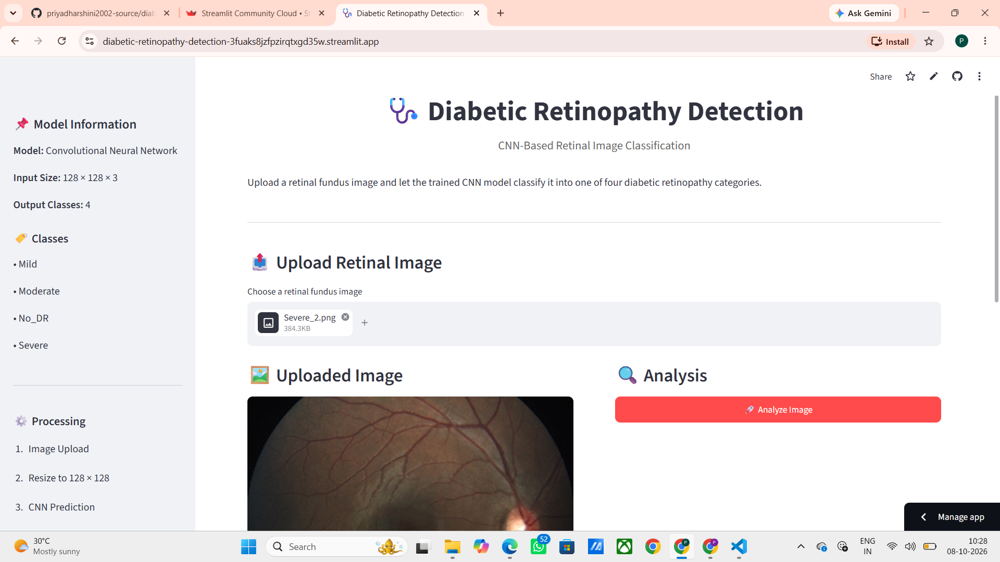

# 🩺 Diabetic Retinopathy Detection Using CNN

A deep learning-based web application for detecting **Diabetic Retinopathy (DR)** from retinal fundus images using a **Convolutional Neural Network (CNN)**.

The model classifies retinal images into four categories:

- 🟢 **No DR**
- 🟡 **Mild**
- 🟠 **Moderate**
- 🔴 **Severe**

The trained model is integrated with a **Streamlit web application**, allowing users to upload a retinal image and receive a predicted DR category along with the confidence score and class probabilities.

---

## 🚀 Live Demo

**Diabetic Retinopathy Detection Web Application**

 Deployed Streamlit link here:


https://diabetic-retinopathy-detection-3fuaks8jzfpzirqtxgd35w.streamlit.app/
---

## 📌 Project Overview

Diabetic Retinopathy is an eye condition associated with diabetes that can affect the blood vessels of the retina and may lead to vision impairment.

This project demonstrates how **Deep Learning and Computer Vision** can be used to analyze retinal images and classify them according to the severity of diabetic retinopathy.

The system uses a CNN trained on retinal fundus images and provides an easy-to-use Streamlit interface for image-based prediction.

---

## 🎯 Objectives

The main objectives of this project are:

- To develop a CNN-based image classification model for diabetic retinopathy.
- To classify retinal images into four severity categories.
- To process retinal images automatically using deep learning.
- To provide prediction confidence and class probabilities.
- To build an interactive web interface using Streamlit.
- To demonstrate the practical application of deep learning in healthcare image analysis.

---

## 🧠 Classification Classes

The model predicts one of the following four classes:

| Class | Description |
|---|---|
| **No_DR** | No visible diabetic retinopathy |
| **Mild** | Mild stage diabetic retinopathy |
| **Moderate** | Moderate stage diabetic retinopathy |
| **Severe** | Severe stage diabetic retinopathy |

---

## 🏗️ Model Architecture

The project uses a **Convolutional Neural Network (CNN)** architecture.

### CNN Architecture

```text
Input Image
    │
    ▼
128 × 128 × 3
    │
    ▼
Conv2D – 32 Filters
    │
    ▼
MaxPooling
    │
    ▼
Batch Normalization
    │
    ▼
Conv2D – 64 Filters
    │
    ▼
MaxPooling
    │
    ▼
Batch Normalization
    │
    ▼
Conv2D – 64 Filters
    │
    ▼
MaxPooling
    │
    ▼
Batch Normalization
    │
    ▼
Conv2D – 96 Filters
    │
    ▼
MaxPooling
    │
    ▼
Batch Normalization
    │
    ▼
Conv2D – 32 Filters
    │
    ▼
MaxPooling
    │
    ▼
Batch Normalization
    │
    ▼
Dropout
    │
    ▼
Flatten
    │
    ▼
Dense – 128 Neurons
    │
    ▼
Dropout
    │
    ▼
Dense – 4 Neurons
    │
    ▼
Softmax
    │
    ▼
DR Classification
```

### Model Configuration

- **Input Size:** 128 × 128 × 3
- **Model Type:** Convolutional Neural Network
- **Activation:** ReLU
- **Output Activation:** Softmax
- **Optimizer:** Adam
- **Loss Function:** Categorical Cross-Entropy
- **Output Classes:** 4
- **Dropout:** 0.2 and 0.3
- **Training Epochs:** 100
- **Batch Size:** 8

---

## 🔄 How the System Works

```text
User Uploads Retinal Image
            │
            ▼
     Image Preprocessing
            │
            ▼
     Resize to 128 × 128
            │
            ▼
      CNN Model Prediction
            │
            ▼
       Softmax Probabilities
            │
            ▼
    ┌─────────────────────┐
    │ Predicted DR Class  │
    │ Confidence Score    │
    │ Class Probabilities │
    └─────────────────────┘
```

---

## ✨ Features

### 🖼️ Image Upload

Users can upload a retinal fundus image through the Streamlit interface.

### 🤖 CNN-Based Prediction

The uploaded image is processed by the trained CNN model.

### 📊 Confidence Score

The application displays the confidence associated with the predicted class.

### 📈 Class Probabilities

The application provides probability values for all four DR categories.

### 🌐 Interactive Web Interface

The model is deployed through Streamlit, making the prediction system accessible through a web browser.

### 🔍 Multiple Image Formats

The application can process common image formats supported by PIL.

---

## 🛠️ Technologies Used

| Technology | Purpose |
|---|---|
| **Python** | Programming language |
| **TensorFlow / Keras** | Deep learning model |
| **CNN** | Retinal image classification |
| **NumPy** | Numerical computation |
| **Pillow (PIL)** | Image processing |
| **Streamlit** | Web application |
| **Git & GitHub** | Version control and project hosting |

---

## 📂 Project Structure

```text
DIABETIC_RETINOPATHY/
│
├── data/
│   ├── train/
│   │   ├── severe/
│   │   ├── mild/
│   │   ├── moderate/
│   │   └── no_DR/
│   │
│   ├── val/
│   │   ├── severe/
│   │   ├── mild/
│   │   ├── moderate/
│   │   └── no_DR/
│   │
│   └── test/
│       ├── severe/
│       ├── mild/
│       ├── moderate/
│       └── no_DR/
│
├── app.py
├── train.py
├── test.py
├── model1.h5
├── model1.json
├── requirements.txt
└── README.md
```

---

## ⚙️ Installation

### 1. Clone the Repository

```bash
git clone https://github.com/priyadharshini2002-source/diabetic-retinopathy-detection.git
```

### 2. Navigate to the Project Directory

```bash
cd diabetic-retinopathy-detection
```

### 3. Install Dependencies

```bash
pip install -r requirements.txt
```

---

## ▶️ Run the Application Locally

Start the Streamlit application using:

```bash
streamlit run app.py
```

The application will open in your browser.

---

## 📋 Requirements

The project uses the following Python packages:

```text
streamlit
tensorflow
numpy
pillow
```

---

## 🔬 Model Prediction Process

The prediction pipeline follows these steps:

### Step 1 — Upload Image

The user uploads a retinal fundus image.

### Step 2 — Image Preprocessing

The uploaded image is:

- Loaded using PIL
- Converted into RGB format when necessary
- Resized to **128 × 128 pixels**
- Converted into a NumPy array

### Step 3 — CNN Prediction

The processed image is passed to the trained CNN model.

### Step 4 — Class Selection

The model produces probabilities for the four classes.

The class with the highest probability is selected as the predicted category.

### Step 5 — Display Results

The application displays:

```text
Predicted Class
      +
Confidence Score
      +
Class Probabilities
```

---

## 📊 Output Example

Example prediction output:

```text
Predicted Condition: Moderate

Confidence: 92.45%

Class Probabilities:

Mild       : 2.31%
Moderate   : 92.45%
No_DR      : 3.14%
Severe     : 2.10%
```

*The values above are only an example. Actual predictions depend on the uploaded retinal image.*

---

## 🌐 Deployment

The application is deployed using **Streamlit Community Cloud**.

The deployment workflow is:

```text
Local Project
     │
     ▼
   GitHub
     │
     ▼
Streamlit Community Cloud
     │
     ▼
Live Web Application
```

---

## 📸 Screenshots
## 📸 Screenshots

### 🏠 About the Project

about_project.png

---

### 🩺 Diabetic Retinopathy Predictions

#### Moderate Diabetic Retinopathy

DR_moderate.png

#### Severe Diabetic Retinopathy



#### No Diabetic Retinopathy

no_dr.png

#### Mild Diabetic Retinopathy

mild.png

---

### 📊 Prediction Accuracy / Results

#### No DR — Accuracy Result

no_dr_accracy.png

#### Mild — Accuracy Result

mild.png

#### Moderate — Accuracy Result

moderate_accuracy.png

#### Severe — Accuracy Result 
DR_severe_accuracy.png


## ⚠️ Medical Disclaimer

This project is developed for **educational, research, and demonstration purposes only**.

The predictions generated by this application should **not be considered a medical diagnosis**.

The application is not intended to replace:

- Ophthalmologists
- Medical professionals
- Clinical examination
- Professional diagnostic equipment

Users should consult a qualified healthcare professional for medical diagnosis and treatment decisions.

---

## ⚠️ Project Limitations

Some limitations of the current implementation include:

- Model performance depends on the quality of retinal images.
- Predictions may not be reliable for images significantly different from the training data.
- The model is intended as an educational demonstration rather than a clinical diagnostic system.
- Dataset characteristics can affect model generalization.
- Further validation on diverse clinical datasets would be required before real-world medical use.

---

## 🔮 Future Enhancements

Possible future improvements include:

- 📈 Improving model accuracy using transfer learning.
- 🧠 Experimenting with architectures such as ResNet, EfficientNet, and DenseNet.
- 🔍 Adding explainable AI techniques such as Grad-CAM.
- 🖼️ Improving retinal image preprocessing.
- 📊 Adding detailed performance dashboards.
- 📱 Developing a mobile-friendly version.
- ☁️ Improving cloud deployment and scalability.
- 🩺 Integrating expert-reviewed clinical datasets.
- 🔬 Performing additional validation using external datasets.

---

## 💡 Learning Outcomes

Through this project, the following concepts were explored:

- Convolutional Neural Networks
- Image Classification
- Image Preprocessing
- Data Augmentation
- Batch Normalization
- Dropout
- Softmax Classification
- Model Training
- Model Prediction
- TensorFlow/Keras
- Streamlit Deployment
- GitHub Version Control
- Healthcare AI

---

## 👩‍💻 Author

**S. Priyadharshini**

MSc Data Science

GitHub: `priyadharshini2002-source`

---

## ⭐ Project

If you find this project useful for learning about **Deep Learning, Computer Vision, and Healthcare AI**, consider giving the repository a ⭐.

---

### 📌 Disclaimer

This project is intended solely for educational and research purposes and should not be used for medical diagnosis or clinical decision-making.
